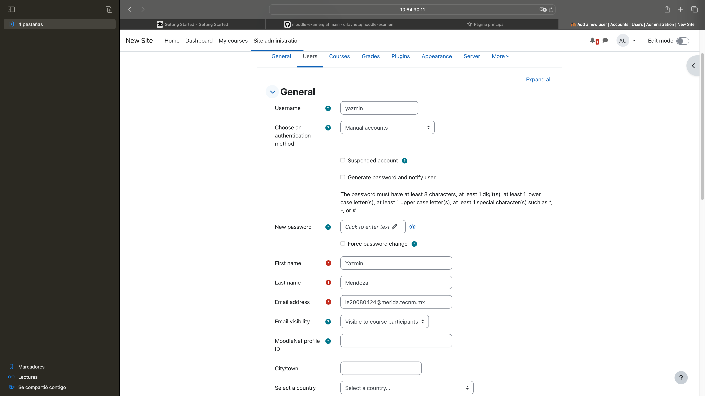

# Clonar y correr el servicio moodle

`git clone https://github.com/orlayneta/moodle.git`

`cd moodle`

`docker compose up -d`

# Acceder al servicio ya corriendo

para ingresar al sitio utilizar su ipv4 con el puerto 8200

ejemplo:

http://10.64.90.11:8200

o

Ver en "localhost:8200"

# Credenciales de acceso

Usuario: User

Password: p4ssw0rd

# GUIA BASICA PARA UTILIZAR MOODLE

Al acceder al sitio de encontrara algo similar a esta pagina

Accediendo como administradores añadimos usuarios para diferentes tipos de roles

ejemplo:

se pueden añadir los usuarios necesarios:

creamos un curso 

añadimos usuarios al curso que previamente fueron registrados por el administrador

asignamos los roles correspondientes a cada usuario

se visualiza la lista de usuarios con sus respectivos roles 

al acceder al curso de visualiza la informacion

